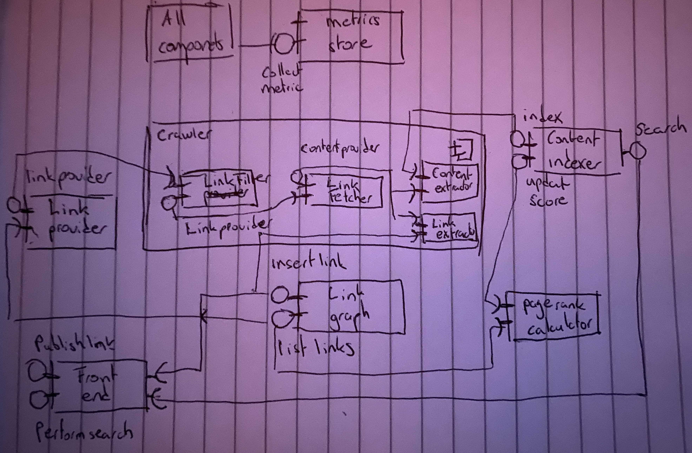

# Notes

## Focus
- finish the entire system as soon as possible, refactor later
- don't focus too much on perfecting OOP etc with limited python
- project tech and design is too interesting to get stuck at boilerplate stuff

## Design

### Crawler
- operates on a set of links seeded or discovered while crawling previous set 
- package encapsulating a pipeline: LinkFilter, LinkFetcher, ContentExtractor, LinkExtractor

##### LinkFilter 
- filters content for cost reduction
- before fetching remote link, LinkFilter identifies content and drop links

##### LinkFetcher
- establish HTTP to link (filtered), download content
- handle 3xx: follow redirects until reach content's final dest
- prevent infinite redirects: max redirect hop counter
- handle Content-Type: js / images from remote; drop the link

##### ContentExtractor
- identify and extract all text from doc downloaded from remote server
- plain text docs direct pass through, HTML docs need element stripping
- content sent to ContentIndexer, which tokenizes and updates search index

##### LinkExtractor
- extract all links identified in HTML docs (regex)
- edge-cases: relative links, `<head><base href>` (parsing), protocol missing
- send new discoverd links to graph to create and update existing connections

### ContentIndexer
- maintain full-text index of all docs retrieved by crawler, ContentExtractor
- exposes methods for full-text search against index + order chronologic or rank

### LinkProvider
- periodically scrubs the link graph and collects new candidate links next crawl pass
- candidate links
    - recently discovered but not crawled
    - links for which recent crawl attempts failed (404)
    - links sucessfully crawled in past but need refresh due to content change
- streaming
    - too many links in world (7 x 10^9)
    - during scrubbing, candidate passed to crawler for processing

### Link Graph
- map all links crawler has discovered and their connections
- exposes interfaces for adding / removing links to graph and query
- components that use the graph
    - LinkProvider: queries graph to decide which links crawl next
    - LinkExtractor: adds newly discovered links to graph
    - PagerankCalculator: access entire graph for generating scores
- CQRS: command query responsibility segragation 
    - separate write from read models in components (optimize in isolation)
    - Commands: mutate model state, Queries: retrieve and return current state
    - execute different business logic paths for reads and writes
    - complex access patterns: synchronous writes with asynchronous reads
    - could utilize separate data stores for writes and reads
    - writes eventually feed into the read store
    - read store could accept other external data

### PagerankCalculator
- async periodic scores calc for each link in graph
- obtain snapshot graph state (vertices / page dest, edges / links
- after calculation, async  updates indexer with new scores (not interfear seach)

### FrontEnd
- HTML for: submit links for indexing, search word or phrase, paginate
- only entry point of system: thus also API gateway
- aggregates async calls in parallel
- expose REST, while enabling RPC internally
